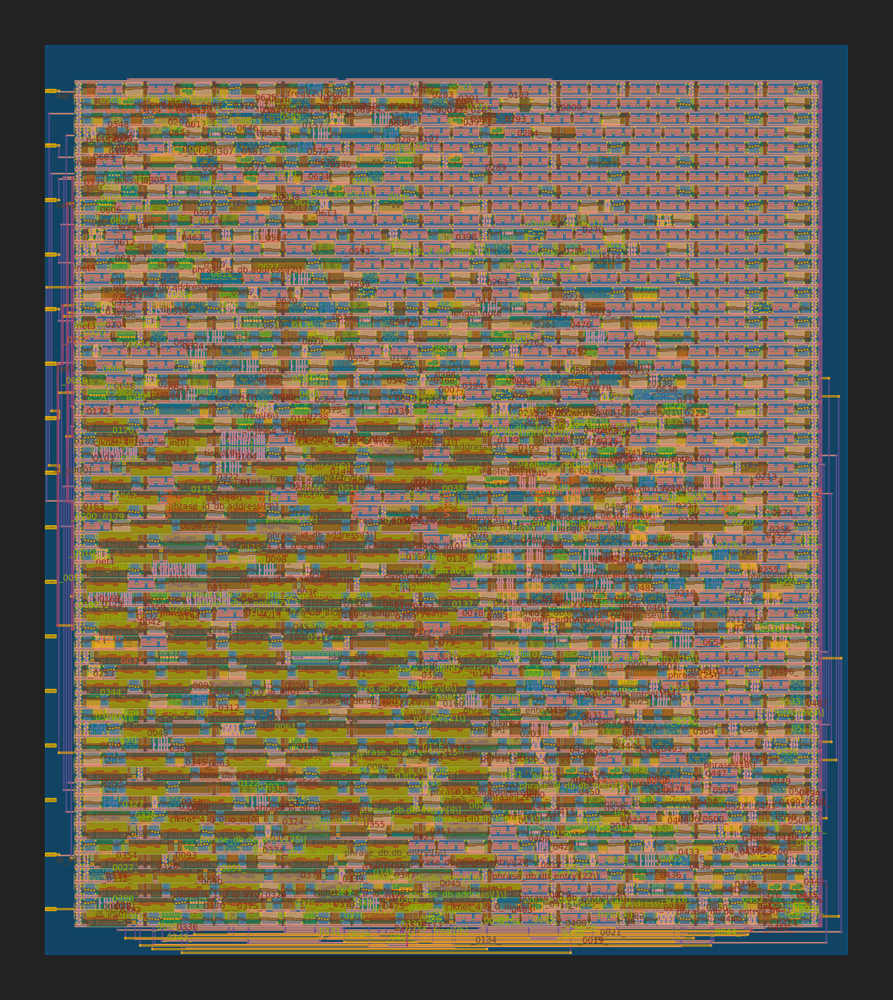

  

# TinyTapeout tt03: Bad Apple #

## Overview ##
This Chip design plays [Bad Apple!! by Alstroemeria Records](https://www.youtube.com/watch?v=FtutLA63Cp8) over Piezeo Speaker connected accross io_out[1:0]. (Based on [TinyTapeout tt02: Super Mario Tune on A Piezo Speaker](https://github.com/meriac/tt02-play-tune) .)

## Data Compression ##
Since the song is longer than 3 minutes, put every single note into TinyTapeout design wasn't able to do.
Thus, data compression was performed from the song contains repeated phrases and having limited pitch and length of notes.

To compress data, following method was used.

1. Split the song with phrase, which contain maximum of 8 notes, and having equivalent length of whole note or half note. For phrases having length of whole note contains 4th or 8th notes. These phrases have [phrase id](https://github.com/shadow1229/tt03-bad-apple/blob/main/src/phrase_id_db.v) <16, while phrases having length of half note contains 8th, 16th or triplet notes and having phrase id >= 16. For the triplet, only phrase id 23 (=5'b10111) has triplet, and every note in the phrase is triplet.

2. To compress length and frequency of notes in phrase, the phrase has id of frequency and length of each note, while the value is saved in another verilog script. Ids of frequency saved as 32 bit number, which act as array of 8 4-bit number, while ids of length saved as 8 bit number act as array of 8 1-bit number. Additionally, there is another 3-bit number for saving number of notes in the phrase, owing to each phrase may have different number of notes. For whole note phrase, these ids is saved in [phrase_db.v](https://github.com/shadow1229/tt03-bad-apple/blob/main/src/phrase_db.v), while half note phrase is saved in [phrase_db_2.v](https://github.com/shadow1229/tt03-bad-apple/blob/main/src/phrase_db_2.v). In these codes, ids of frequency is written as "db_entry" (ex: 32'h5A8C0630), and ids of length is written as "length_entry" (ex: 8'b00001000), and number of notes is written as "n_note"(ex: 3'b110). In these codes, n_note actually represents (number of notes -1), for ease of using counter. For triplet, length_entry of phrase id 23 is ignored and replaced with the note length of triplet from the [player.v](https://github.com/shadow1229/tt03-bad-apple/blob/main/src/player.v), which is the top module.

3. The frequency of each note id is saved in [freq_db.v](https://github.com/shadow1229/tt03-bad-apple/blob/main/src/freq_db.v) (note id from whole note phrase) and [freq_db_2.v](https://github.com/shadow1229/tt03-bad-apple/blob/main/src/freq_db_2.v) (note id from half note phrase). Thankfully, the song uses less than 16 frequencies for each pharse type, except few full-note phrases in final part, due to key shift. Thus, rather than saving note frequency id with 5-bit number, is_highkey in player.v was used to the indicator of key shift late part of the song. since half-note phrase has less diverisity of frequencies, is_highkey was not used in there. For the length of note, player.v checks phrase_id and length_entry and gives the length of the note. 

## The logic of top module of the design ##
The top module has 2-bit counter (counter_cycle) to read id of phrase, phrase, length id & freq id of the note, and length & frequency of the note separately.
For each posedge of clk, counter_cycle increased by 1.
If counter_cycle is 0, the module will read phrase id for given phrase address, which starts from 0 and increases by 1 when the phrase ends.
If counter_cycle is 1, the module will read phrase data from phrase id.
If counter_cycle is 2, the module will read id of the frequency and length of current note.
Finally, if counter_cycle is 3, the module will read frequency and length of the note from its ids. 

## Designed Chip ##

## Simulated Sound ##
[https://github.com/shadow1229/tt03-bad-apple/blob/main/generator/simulation.wav](https://github.com/shadow1229/tt03-bad-apple/blob/main/generator/simulation.wav) (warning: file size is ~80MB)

## python scripts for building / testing verilog script ##
[https://github.com/shadow1229/tt03-bad-apple/blob/main/generator](https://github.com/shadow1229/tt03-bad-apple/blob/main/generator)
(mostly based on [TinyTapeout tt02: Super Mario Tune on A Piezo Speaker](https://github.com/meriac/tt02-play-tune)

## External Hardware Required ##
Piezo speaker connected across io_out[1:0]

## Playing with actual chip ##

https://arweave.net/MCLI3o825EvwRUoGVgnB28NpFcIt-4uTeMMWMVU72Cw